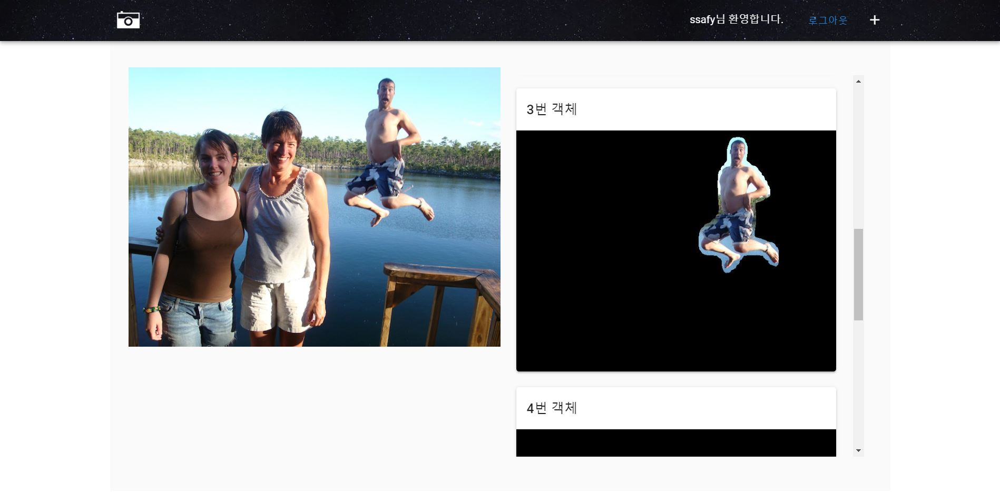
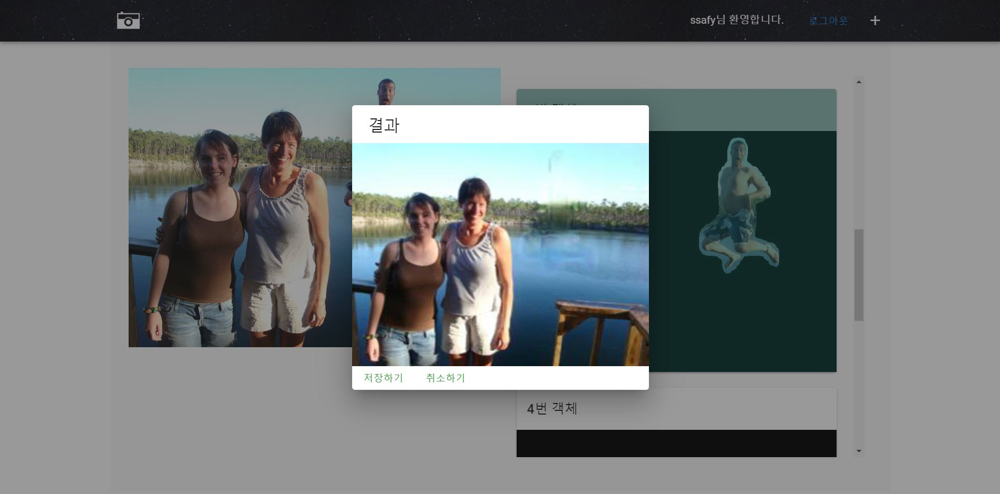
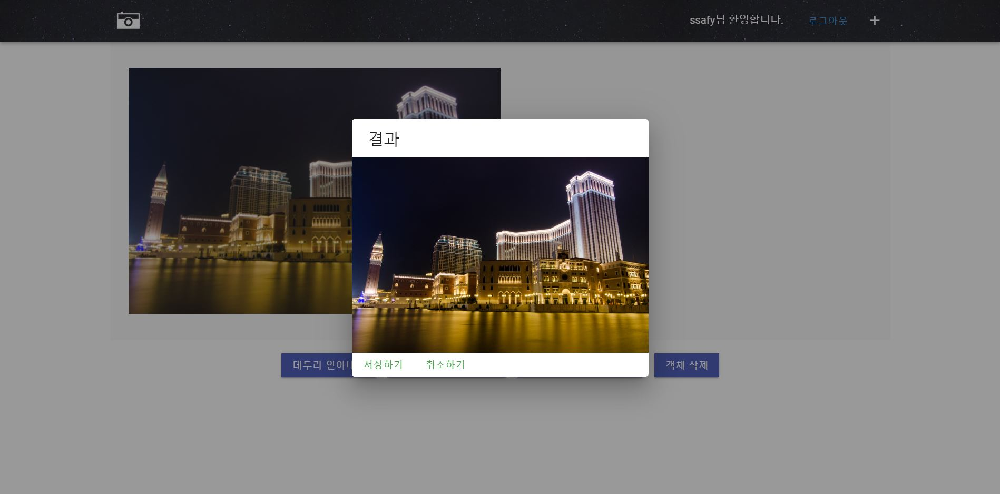

# Smart Image Editor

Smart Image Editor(스마트 이미지 편집기)는 이미지 품질을 향상하고 이미지를 원하는대로 수정하는데 초점을 맞춘 인공지능 기반 서비스입니다.

1. 객체 탐지 및 제거(Mask R-CNN)
2. 제거된 영역 복구 (Inpainting)
   https://en.wikipedia.org/wiki/Inpainting
3. 업스케일링 (Super Resolution)
   https://en.wikipedia.org/wiki/Super-resolution_imaging

## 객체 탐지 및 제거



## 제거된 영역 복구



## 업스케일링



### 업스케일링 결과물 비교

#### 적용 전


---

#### 적용 후


# Django 설정

1. visual code로 S02P31C101를 OPEN한다
2. ctrl + shift + p 를 눌러 명령 팔레트를  연다
3. 명령 팔레트에 Python:Select interpreter를 입력하여  AI를 작업했던 가상환경의 interpreter를 선택한다
   1. ex) conda의 가상환경 이름이 pytorch_env라면
   2. Anaconda3/envs/pytorch_env/python.exe를 interpreter로 설정한다
   3. Python:Select Interpreter가 나오지 않으면 검색을 해서.... 해결하도록
4. 설정이 끝났으면 visual code의 terminal을 git bash가 아닌 cmd로 설정한다
5. 아래의 명령어를 입력한다.

```bash
# Windows 10 개발환경 기준입니다. 배포(Linux)환경에서는 추가적인 작업이 필요할 수 있습니다.
$ conda create -n 가상환경이름 python=3.7
$ conda activate 가상환경이름
$ conda install pytorch torchvision cudatoolkit=10.1 -c pytorch
$ cd s02p31c101/Back/Django
$ pip install -r requirements.txt
```

```bash
# DB
$ python manage.py makemigrations
$ python manage.py migrate

# Django 실행
$ python manage.py runserver  
```

## 배포(Linux)환경 opencv-python 관련 에러

GUI가 아닌 OS에서는 다음과 같은 문제가 발생할 수 있습니다.

apt-get 명령어를 이용하여 해결할 수 있습니다.

```text
  File "/home/ubuntu/deploy/s02p31c101/Back/Django/main/views.py", line 36, in <module>
    import prosr_test
  File "/home/ubuntu/deploy/s02p31c101/Back/AI/prosr_library/prosr_test.py", line 19, in <module>
    import cv2
  File "/home/ubuntu/anaconda3/envs/release-0.6.3/lib/python3.7/site-packages/cv2/__init__.py", line 5, in <module>
    from .cv2 import *
ImportError: libSM.so.6: cannot open shared object file: No such file or directory
```

```bash
$ apt-get update
$ apt-get install -y libsm6 libxext6 libxrender-dev
$ pip install opencv-python
```

# Vue 설정

1. 먼저 node js를 설치한 적이 없다면 node.js를 먼저 설치한다

2. 터미널에서 다음 명령어를 입력한다

   ```bash
   $ npm install -g @vue/cli
   $ cd S02P31C101/Front/
   $ npm install .
   $ npm run serve
   ```

# AI SERVICE

1. S02P31C101/Back/Django/main/views.py에 가면 다음 함수들이 있음.
   1. mask_rcnn
   2. resolution_up
   3. inpainting
2. 각자 해당하는 함수가 동작하는지 확인한다.
   1. 아쉽게도 동작을 확인하려면 Front,Django 전부다 실행을 시키고 웹에서 버튼을 눌러가며 테스트를 해봐야 한다.
3. Back에서 AI함수를 호출하는게 안될 것 
   1. pip install . 을 이용하는 방법이 있고
   2. 기타 등등이 있을 듯
   3. 특화 프로젝트 때는 pip install . 을 통해 AI 패키지 자체를 빌드해서 해결했다

# Requirement

+ mask-rcnn training
  + pycocotools
    + pip3 install numpy==1.17.4
    + pip3 install Cython
    + window :
      + pip install git+https://github.com/philferriere/cocoapi.git#egg=pycocotools^&subdirectory=PythonAPI
    + linux:
      + git clone https://github.com/cocodataset/cocoapi.git
      + cd PythonAPI
      + make

+ EDSR
  + numpy
  + scikit-image
  + imageio
  + matplotlib
  + tqdm
  + opencv-python
  + pillow (PIL)

+ PROSR
  + 환경은 반드시 Python 3.8 이전 버전 사용할 것
  + (현재 사용되지 않음) conda install pytorch=0.4.1 torchvision cuda91 -c pytorch
    + pytorch는 반드시 저 버전으로 설치할 것 이후 버전은 내장 함수, 클래스를 변경하여 작동이 안됨....
  + conda install scikit-image cython
  + conda install visdom dominate -c conda-forge
  + python3.7 -m pip install easydict pillow
  + Search Path (아래 과정을 수행하지 않아도 동작되도록 수정됨 : https://lab.ssafy.com/s02-final/s02p31c101/issues/4)
    + export PYTHONPATH=$PROJECT_ROOT/lib:$PYTHONPATH to include proSR into the search path.
    + Window일경우 제어판 - 시스템 - 환경변수에서 PYTHONPATH 이름 지정해주고 경로 설정 해주면 됨
    ```text
    변수 이름 : PYTHONPATH
    변수   값 : s02p31c101\Back\AI\prosr_library\lib
    ```

# NGINX 설정

NGINX 설치 후 `/etc/nginx/site-avaliable/site-avaliable` 위치에 아래 파일을 작성한다.

이때의 파일 이름은 `project-3`으로 명명되었다.

```bash
$ sudo touch /etc/nginx/sites-available/project-3
$ sudo ln -s /etc/nginx/sites-available/project-3 /etc/nginx/sites-enabled/project-3
$ sudo vim /etc/nginx/sites-available/project-3
```

```text
# /etc/nginx/site-avaliable/project-3 파일 내용

# the upstream component nginx needs to connect to
upstream django {
    server 127.0.0.1:8001; # for a web port socket (we'll use this first)
}

server {
    listen      80;
    server_name k02c1011.p.ssafy.io;
    charset utf-8;
    root    /home/ubuntu/deploy/s02p31c101/Front/dist;  # Frontend build 결과물 위치
    index   index.html index.htm;
    # Always serve index.html for any request
    location / {
        root /home/ubuntu/deploy/s02p31c101/Front/dist;  # Frontend build 결과물 위치
        try_files $uri /index.html;
    }
    error_log  /var/log/nginx/project-3-error.log;
    access_log /var/log/nginx/project-3-access.log;
}

# original source file chmod : -rw-r--r--
```

```bash
$ sudo service nginx start
```

# uWSGI

```bash
$ cd 프로젝트_경로
(이동 후 s02p31c101/Back/Django 위치가 되어야 합니다.)
$ nohup uwsgi --http :8000 --wsgi-file /home/ubuntu/deploy/s02p31c101/Back/Django/sub3/wsgi.py >/dev/null 2>&1 &
```
